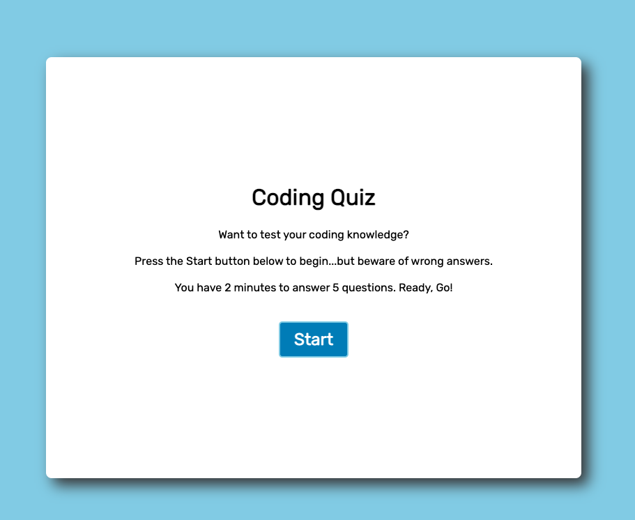
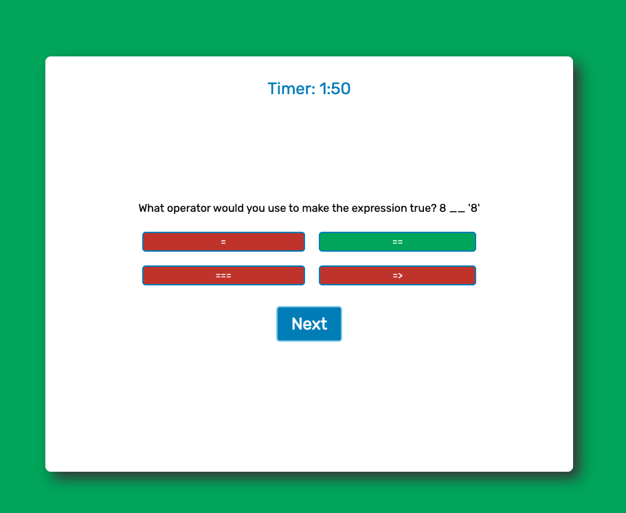
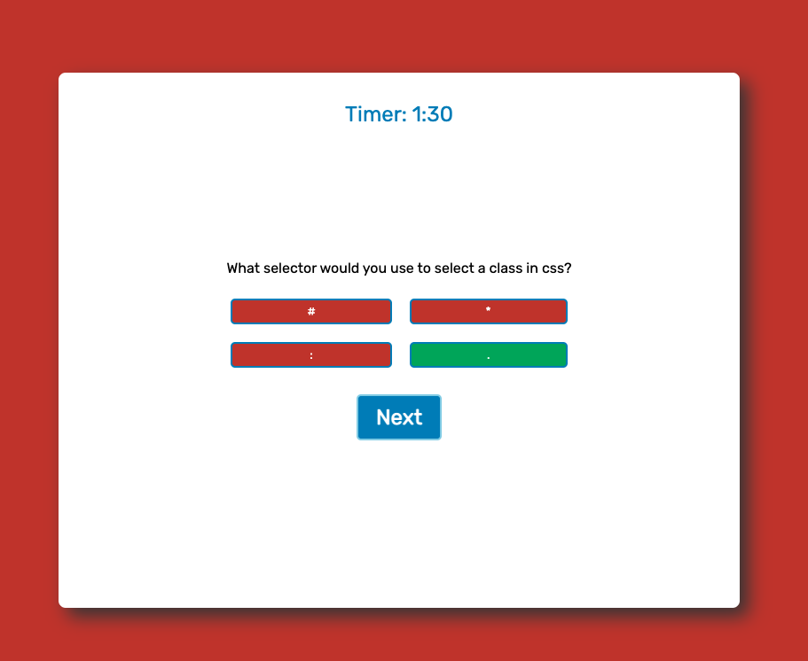
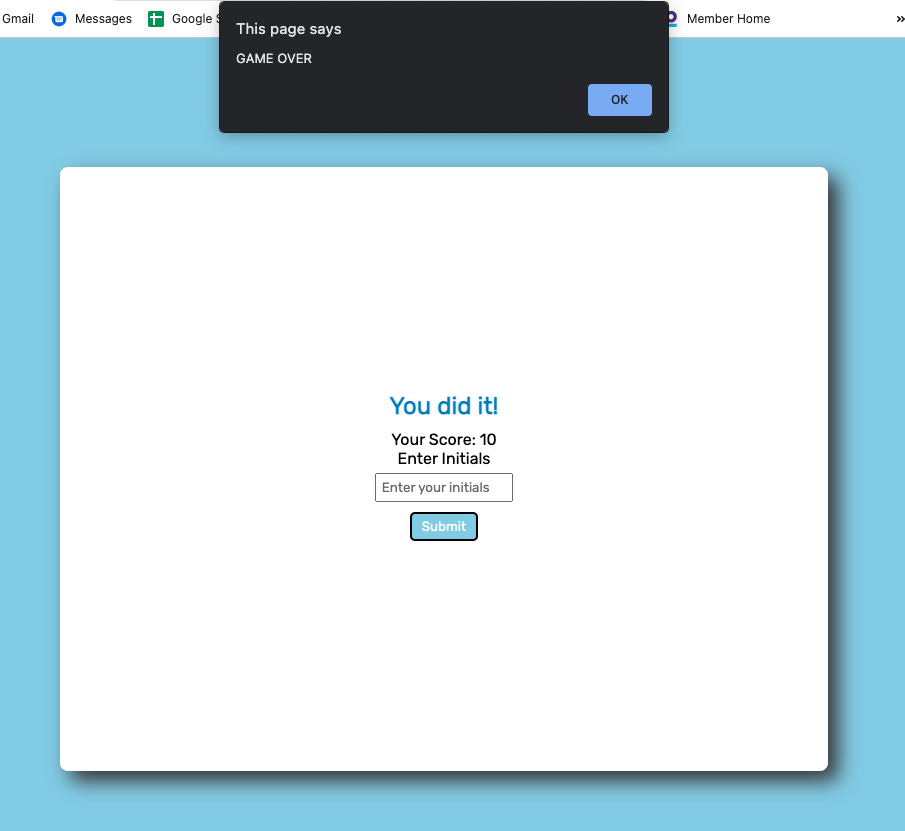

# Code Quiz Project

## User Story 
>AS A coding boot camp student  
I WANT to take a timed quiz on JavaScript fundamentals that stores high scores 
SO THAT I can gauge my progress compared to my peers

## Description

This project tested my knowledge of JavaScript and APIs.  I ensured that the code was debugged to the best of my ability and ran correctly.  This assignment was very challenging due to implementing JS concepts that we have not yet covered in class. When I got stuck I used Google to research password generators and read through StackOverflow, and watched many YouTube videos, as well as researching specific elements in W3Schools and MDN. 

I refererenced the following resources to assist in this project:
* Referenced codestudio tutorial on how to write a javascript quiz: https://www.codingninjas.com/codestudio/library/how-to-create-a-javascript-quiz-code 
* Referenced Build A Quizz App with JavaScript YouTube video from Web Dev Simplified: https://www.youtube.com/watch?v=riDzcEQbX6k 
* Referenced Simple Countdown Timer with JavaScript YouTube video from Florin Pop: https://www.youtube.com/watch?v=x7WJEmxNlEs
* Referenced Save High Scores in Local Storage YouTube video from James Q Quick: https://www.youtube.com/watch?v=DFhmNLKwwGw&list=PLDlWc9AfQBfZIkdVaOQXi1tizJeNJipEx&index=9

---

## Links

- Click the link below to access the deployed site on GitHub Pages. 
https://magmesser.github.io/code-quiz/

- Click the link below to access to application repository on GitHub.  
https://github.com/magmesser/code-quiz

---

## Screenshot

The following images are screenshots of the web application's appearance: 

 
Coding Quiz landing page

 
Correct answer choice reaction 

 
Wrong answer choice reaction

 
Game Over - completed quiz or timed out 

 
High Score scoreboard

